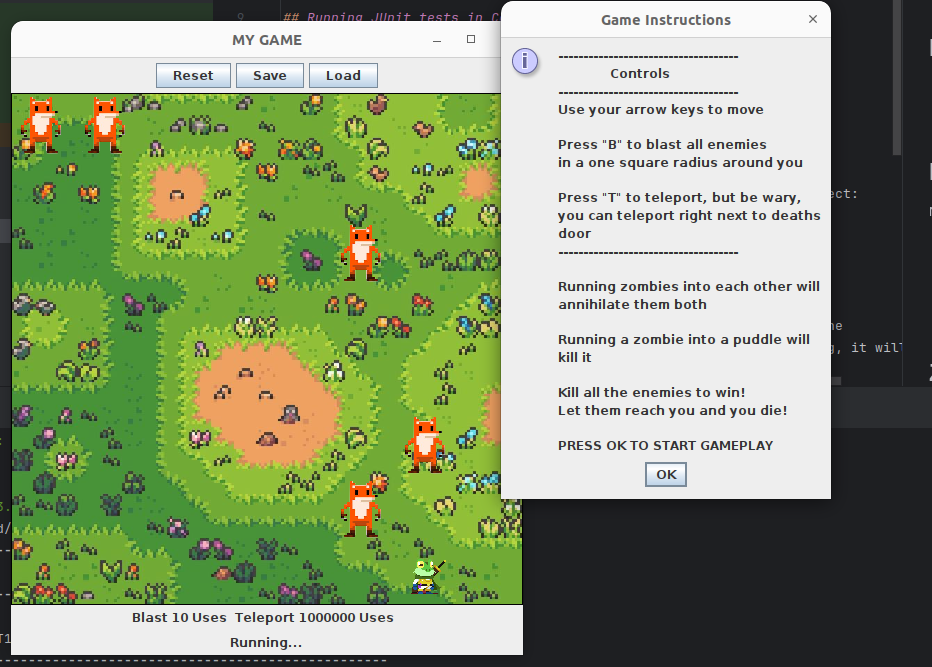

# Jungle Runner

A fast, grid‑based, top‑down arcade game built in **Java 8** with **Swing** and packaged using **Maven**. Dodge enemies, leverage abilities, and clear the board.

> This repository is course‑neutral and ready to share. It showcases clean Java 8 code, a focused Swing UI, and a reproducible Maven build.

---

## 🎮 Gameplay

- **Grid**: 8×8 board with 64‑pixel sprites.
- **Player**: move with **Arrow Keys**.
- **Blast (B)**: remove enemies in a one‑square radius (default ~10 uses).
- **Teleport (T)**: jump to a random tile (effectively unlimited by default).
- **Environment**: puddles and other tiles influence play.
- **Save / Load / Reset**: persist and restore runs (`savedGame.txt`).
- **In‑game instructions**: modal dialog at launch.

**Controls**
```
Arrow Keys  Move
B           Blast nearby enemies
T           Teleport (risky)
```



---

## 🧱 Project Layout

```
.
├─ pom.xml                         # Maven build (Java 8, exec JAR)
├─ src/
│  ├─ main/java/org/jungle/runner/
│  │  ├─ Game.java                 # Entry point (contains main)
│  │  └─ myGame/
│  │     ├─ RunMyGame.java         # Frame + controls + wiring
│  │     ├─ MyGameCourt.java       # Game loop, rendering, input
│  │     ├─ MyGameObj.java         # Base entity
│  │     ├─ Player.java, Zombie.java, Puddle.java
│  │     ├─ Attack.java            # Abstract attack
│  │     ├─ Blast.java, Teleport.java
│  │     ├─ Square.java, Direction.java
│  └─ test/java/org/jungle/runner/
│     ├─ CompilationTest.java      # Verifies main signature
│     └─ myGame/JUnitTest.java     # Core gameplay tests
└─ files/                           # Art assets (PNG/JPG)
```

---

## 🛠️ Build & Run

**Prerequisites**
- JDK **8** (1.8). Verify with `java -version` → `1.8.0_xxx`.
- Maven **3.6+**.

**Compile & test**
```bash
mvn clean test
```

**Package**
```bash
mvn package
```
Produces `target/jungle-runner-1.0.0.jar`.

**Run**
```bash
java -jar target/jungle-runner-1.0.0.jar
# or, by class name:
java -cp target/jungle-runner-1.0.0.jar org.jungle.runner.Game
```

---

## 📦 Maven Highlights

The build is intentionally simple and Java‑8‑friendly:

```xml
<properties>
  <maven.compiler.source>1.8</maven.compiler.source>
  <maven.compiler.target>1.8</maven.compiler.target>
  <project.build.sourceEncoding>UTF-8</project.build.sourceEncoding>
</properties>

<build>
  <finalName>jungle-runner-${project.version}</finalName>
  <plugins>
    <!-- Compile for Java 8 -->
    <plugin>
      <artifactId>maven-compiler-plugin</artifactId>
      <version>3.8.1</version>
      <configuration>
        <source>1.8</source>
        <target>1.8</target>
      </configuration>
    </plugin>

    <!-- JUnit 5 runner -->
    <plugin>
      <artifactId>maven-surefire-plugin</artifactId>
      <version>2.22.1</version>
    </plugin>

    <!-- Executable JAR with manifest -->
    <plugin>
      <artifactId>maven-jar-plugin</artifactId>
      <version>3.3.0</version>
      <configuration>
        <archive>
          <manifest>
            <mainClass>org.jungle.runner.Game</mainClass>
          </manifest>
        </archive>
      </configuration>
    </plugin>
  </plugins>
</build>
```

> Want a single self‑contained JAR? Add `maven-shade-plugin` and set `mainClass` similarly.

**Testing stack**
- JUnit Jupiter 5.7.0
- Surefire 2.22.1

---

## 🧪 Tests

```bash
mvn test
```
- `CompilationTest` ensures `public static void main(String[] args)` exists.
- `JUnitTest` covers gameplay logic.

Add tests under `src/test/java` using `@Test` and `Assertions`.

---

## 🧩 Java Concepts Demonstrated

- **Object‑Oriented Design**
  - `MyGameObj` as a base entity; subclasses `Player`, `Zombie`, `Puddle`.
  - `Attack` abstraction with concrete `Blast` and `Teleport` implementations.
- **Encapsulation & Immutability**
  - Constants for board size, tick interval, and ability limits.
- **Collections & 2D board modeling**
  - `Square[][]` grid; translation between pixel and grid coordinates.
- **Event‑driven UI (Swing)**
  - Action listeners for **Reset / Save / Load**; dialog‑based instructions.
- **Rendering**
  - `paintComponent(Graphics)` pipeline; assets loaded via `ImageIO`.
- **Game loop**
  - Timer‑based updates (tick interval ≈ 35 ms) and repaint cycle.
- **Persistence**
  - `FileReader`/`FileWriter` to save/load `savedGame.txt`.
- **Testing**
  - JUnit 5 tests run automatically via Maven Surefire.
- **Build Tooling**
  - Reproducible Maven build, executable manifest, Java‑8 target bytecode.

---

## ⚙️ Configuration Knobs

Adjust in `MyGameCourt` and related constants:
- `SQUARE_SIZE` and `SPRITE_SIZE` → grid/visual scale
- `BLAST_USES` and teleport uses → ability budgets
- `INTERVAL` → update tick (ms)
- `BACKGROUND` and sprites under `/files` → art assets

---

## 🖼️ Assets

Images live in `/files` and are loaded with `ImageIO`. Replace with your own art; keep file names or update the constants.

---

## 🐛 Troubleshooting

- **`no main manifest attribute`** → ensure `maven-jar-plugin` `mainClass` is `org.jungle.runner.Game`, then `mvn clean package`.
- **JDK mismatch (11/17 errors)** → verify `java -version`, `javac -version`, `mvn -v` all show **1.8**.
- **Cannot find class when running** → run by FQCN: `java -cp target/jungle-runner-1.0.0.jar org.jungle.runner.Game`.

---

## 📄 License

Choose a license (e.g., MIT) and include it in `LICENSE`.

## 🙌 Acknowledgements

Thanks to the Java and open‑source communities for tools and libraries.
